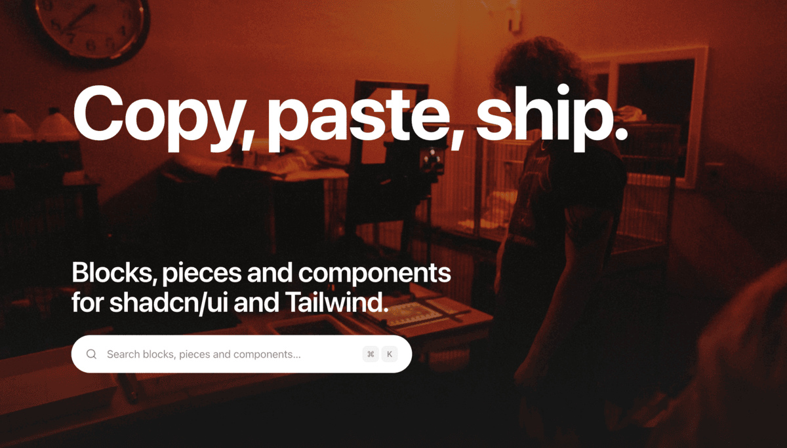

<!--
  The cover ships with the export: public/assets is copied over whole, so this
  path resolves inside the public repo without a separate copy step.
-->
<p align="center">
  
</p>

<h1 align="center">Beste UI</h1>

<p align="center">
  Production-ready sections, pieces and primitives for shadcn/ui and Tailwind CSS.<br />
  Install one with a command, and the code is yours.
</p>

<p align="center">
  <a href="https://ui.beste.co"><b>Browse the library</b></a>
  &nbsp;·&nbsp;
  <a href="https://ui.beste.co/docs">Docs</a>
  &nbsp;·&nbsp;
  <a href="https://ui.beste.co/docs/mcp">AI &amp; MCP</a>
  &nbsp;·&nbsp;
  <a href="https://ui.beste.co/blog">Blog</a>
</p>

<p align="center">
  
  
  
  
  
  
</p>

---

## Install

One command, no package to add, no provider to wrap your app in:

```bash
npx shadcn@latest add https://ui.beste.co/r/hero7
```

The files land in your project. Edit them, delete half of them, rename the props.
There is no upgrade path to fight later, because there is nothing to upgrade.

Works the same for every free item in this repository, by name:

```bash
npx shadcn@latest add https://ui.beste.co/r/pricing12
npx shadcn@latest add https://ui.beste.co/piece/r/code12
npx shadcn@latest add https://ui.beste.co/component/r/button12
```

## What is in here

| | Count | What it is |
| --- | --- | --- |
| **Blocks** | 168 | Full page sections: heroes, pricing tables, FAQs, footers, auth screens |
| **Pieces** | 989 | Small visual widgets that sit inside a block's media slot: mini cards, charts, stat tiles, terminals |
| **Components** | 158 | Design-system primitives: buttons, badges, filters, inspector controls |

The distinction matters when you compose them. A block is a section you drop on
a page. A piece is an asset that belongs inside one. A component is a primitive
you build with.

### Blocks by category

| Category | | Category | | Category | |
| --- | --- | --- | --- | --- | --- |
| Feature | 31 | Error | 6 | Crypto | 3 |
| Hero | 11 | Footer | 5 | Booking | 3 |
| Auth | 10 | Onboarding | 4 | Blog | 3 |
| Use case | 8 | Coming soon | 4 | Travel | 2 |
| Health | 7 | Testimonial | 3 | Showcase | 2 |
| Ecommerce | 7 | Portfolio | 3 | SaaS | 2 |
| Education | 3 | CTA | 3 | Reveal | 2 |

Plus navbar, FAQ, settings, fitness, devtools and terminal sections.
[See them all](https://ui.beste.co/blocks).

## Built for agents, not just for people

Every page in this repository is readable by a model, and the registry is
addressable by one:

- **MCP server.** Point your editor at `https://ui.beste.co/api/mcp` and it can
  search the catalogue, read a section's source, and hand you the install
  command. [Setup](https://ui.beste.co/docs/mcp).
- **Markdown content negotiation.** Send `Accept: text/markdown` to any page and
  you get markdown instead of HTML.
- **`llms.txt`.** A machine-readable index of the whole catalogue at
  [`/llms.txt`](https://ui.beste.co/llms.txt) and
  [`/llms-full.txt`](https://ui.beste.co/llms-full.txt).
- **Semantic search.** Describe the UI you want in a sentence rather than
  guessing at a name.

## Theming

Sections read from CSS variables, so they inherit whatever theme you already
have. The site ships 96 of them and a font picker, and the preview updates live
so you can see a section in your palette before installing it.

Nothing is hardcoded to a brand colour. If your `--primary` changes, every
installed section follows.

## Running it locally

```bash
bun install
bun dev
```

No environment variables, no database, no account system. Everything you can see
in this repository, you can run.

| Command | What it does |
| --- | --- |
| `bun dev` | Codegen, then the dev server |
| `bun run build` | Codegen, then a production build |
| `bun run codegen` | Rebuild the registry indexes from `registry*/` |
| `bun run typecheck` | `tsc --noEmit` |

## Repository layout

```
registry/              one directory per section: .tsx, .meta.ts, README.md
registry-pieces/       the small widgets sections embed
registry-components/   the primitives both are built from
app/                   the site: browsing, previews, search, MCP
components/            the site's own chrome, not part of the registry
lib/                   generated indexes and shared helpers
```

Each item carries its own metadata and README, which is what the site, the
search index and the MCP server all read. Adding a section means adding a
directory, not editing a manifest.

## What is here, and what is not

This repository holds every **free** item in the catalogue, the site that
renders them, and the registry that serves them.

The Pro catalogue (over a thousand more sections), accounts, plans and the
Base UI variant of the registry live on [ui.beste.co](https://ui.beste.co).
Links in this build point there rather than pretending those pages are missing.

## This repository is generated

It is built automatically from a private source repository and synced on every
release. **Manual edits here will be overwritten.**

That does not make contributions unwelcome, it just changes the path they take.
See [CONTRIBUTING.md](./CONTRIBUTING.md).

## Security

Found something? Please do not open a public issue.
See [SECURITY.md](./SECURITY.md).

## License

MIT. Use them at work, in client projects, in things you sell.
See [LICENSE](./LICENSE).

---

## Also from us: beste.co

Every section here is drawn by hand, one at a time. The same ones are the
building material for [**beste.co**](https://beste.co), a website builder.

The difference is not how much craft goes into them, it is what you walk away
with. Here you take the source, and it is yours to change. There you take a
site that is live on a domain, built from these same sections, without standing
up a repository first.

<p align="center">
  <a href="https://beste.co"><b>beste.co</b></a>
  &nbsp;·&nbsp;
  <a href="https://ui.beste.co">ui.beste.co</a>
  &nbsp;·&nbsp;
  <a href="https://x.com/withbeste">@withbeste</a>
</p>
