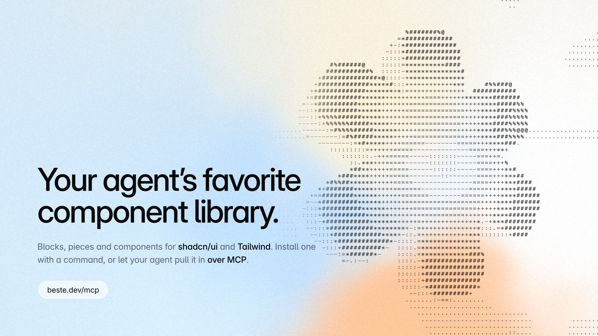

<!--
  The cover ships with the export: public/assets is copied over whole, so this
  path resolves inside the public repo without a separate copy step.
-->
<p align="center">
  
</p>

<h1 align="center">Beste UI</h1>

<p align="center">
  <b>Your agent&rsquo;s favorite component library.</b><br />
  Production-ready sections, pieces and primitives for shadcn/ui and Tailwind CSS.<br />
  Install one with a command, or let your agent pull it in over MCP.
</p>

<p align="center">
  <a href="https://ui.beste.co"><b>Browse the library</b></a>
  &nbsp;·&nbsp;
  <a href="https://ui.beste.co/docs/mcp"><b>Connect your agent</b></a>
  &nbsp;·&nbsp;
  <a href="https://ui.beste.co/docs">Docs</a>
  &nbsp;·&nbsp;
  <a href="https://ui.beste.co/blog">Blog</a>
</p>

<p align="center">
  
  
  
  
  
  
  
</p>

<p align="center">
  Works with <b>Claude Code</b>, <b>Codex</b>, <b>Cursor</b>, <b>Windsurf</b>, <b>GitHub Copilot</b>, <b>Gemini CLI</b>
  and every other agent that speaks MCP.
</p>

---

## Two ways in

**Ask your agent.** Connect the MCP server once, then describe what you want:

> _&ldquo;Add a pricing section with three tiers and a monthly/yearly toggle.&rdquo;_

Your agent searches the catalog, picks a section, reads its source and installs
it into your project. No names to memorize, no docs to open.

**Or run the command yourself.** No package to add, no provider to wrap your app in:

```bash
npx shadcn@latest add https://ui.beste.co/r/hero7
```

Either way, the files land in your project. Edit them, delete half of them,
rename the props. There is no upgrade path to fight later, because there is
nothing to upgrade.

## Connect your agent

The MCP server lives at one URL and speaks the standard Streamable HTTP
transport, so there is no plugin to install and no API key to create:

```
https://ui.beste.co/api/mcp
```

<details open>
<summary><b>Claude Code</b></summary>

```bash
claude mcp add --transport http beste-ui https://ui.beste.co/api/mcp
```

</details>

<details>
<summary><b>Codex</b> (OpenAI Codex CLI and IDE extension)</summary>

Add to `~/.codex/config.toml`:

```toml
[mcp_servers.beste-ui]
url = "https://ui.beste.co/api/mcp"
```

</details>

<details>
<summary><b>Cursor</b></summary>

Add to `.cursor/mcp.json` in your project, or `~/.cursor/mcp.json` for every project:

```json
{
  "mcpServers": {
    "beste-ui": {
      "url": "https://ui.beste.co/api/mcp"
    }
  }
}
```

</details>

<details>
<summary><b>Windsurf</b></summary>

Add to `~/.codeium/windsurf/mcp_config.json`:

```json
{
  "mcpServers": {
    "beste-ui": {
      "serverUrl": "https://ui.beste.co/api/mcp"
    }
  }
}
```

</details>

<details>
<summary><b>VS Code</b> (GitHub Copilot agent mode)</summary>

Add to `.vscode/mcp.json`:

```json
{
  "servers": {
    "beste-ui": {
      "type": "http",
      "url": "https://ui.beste.co/api/mcp"
    }
  }
}
```

</details>

<details>
<summary><b>Gemini CLI</b></summary>

Add to `~/.gemini/settings.json`:

```json
{
  "mcpServers": {
    "beste-ui": {
      "httpUrl": "https://ui.beste.co/api/mcp"
    }
  }
}
```

</details>

<details>
<summary><b>Claude Desktop and claude.ai</b></summary>

Settings → Connectors → Add custom connector, then paste
`https://ui.beste.co/api/mcp`.

</details>

<details>
<summary><b>Everything else</b></summary>

Any client that supports remote MCP servers works with the same URL. That
includes Cline, Roo Code, Kilo Code, Continue, Zed, JetBrains AI Assistant and
Junie, Amp, Kiro, Warp, Goose, OpenCode, Augment Code, Trae, Factory, Qodo and
LM Studio. If a client only speaks stdio, bridge it with
`npx mcp-remote https://ui.beste.co/api/mcp`.

</details>

Full setup, license options and example prompts: [ui.beste.co/docs/mcp](https://ui.beste.co/docs/mcp).

### What your agent can do

| Tool | What it does |
| --- | --- |
| `search_blocks` | Semantic and keyword search across the whole catalog. Describe the UI in a sentence rather than guessing a name. |
| `get_block` | Metadata for one item: description, category, preview URL and the install command. |
| `get_block_source` | The full `.tsx` source, so the agent can read it before it installs anything. |
| `install_block` | The exact shadcn CLI command to drop an item into the project. |
| `compose_page` | Give it a page intent (&ldquo;AI SaaS landing page&rdquo;) and get an ordered set of sections that make a full page. |
| `list_categories` | Every category with its title and description. |
| `list_collections` | The studio collections: sets of sections that share one design language. |

### Try asking

- &ldquo;Find a hero with a product screenshot and a waitlist form.&rdquo;
- &ldquo;Compose a landing page for a developer CLI tool.&rdquo;
- &ldquo;Swap this testimonials block for a marquee of logos.&rdquo;
- &ldquo;Build me a page using sections from one collection, so they match.&rdquo;

### Readable by models, all the way down

The MCP server is the fastest path, not the only one:

- **Markdown content negotiation.** Send `Accept: text/markdown` to any page on
  the site, or add `.md` to its URL, and you get markdown instead of HTML.
- **`llms.txt`.** A machine-readable index of the whole catalog at
  [`/llms.txt`](https://ui.beste.co/llms.txt) and
  [`/llms-full.txt`](https://ui.beste.co/llms-full.txt).
- **A README per item.** Every section in this repository carries one, written
  for the agent that will install it as much as for the person reading it.
- **Plain shadcn registry URLs.** shadcn&rsquo;s own MCP server and CLI work with
  every item here, no Beste tooling required.

## What is in here

| | Count | What it is |
| --- | --- | --- |
| **Blocks** | 168 | Full page sections: heroes, pricing tables, FAQs, footers, auth screens |
| **Pieces** | 1076 | Small visual widgets that sit inside a block's media slot: mini cards, charts, stat tiles, terminals |
| **Components** | 293 | Design-system primitives: buttons, badges, filters, inspector controls |

The distinction matters when you compose them, and it is the same distinction
your agent works with. A block is a section you drop on a page. A piece is an
asset that belongs inside one. A component is a primitive you build with.

Every free item installs the same way, by name:

```bash
npx shadcn@latest add https://ui.beste.co/r/pricing12
npx shadcn@latest add https://ui.beste.co/piece/r/code12
npx shadcn@latest add https://ui.beste.co/component/r/button12
```

### Blocks by category

| Category | | Category | | Category | |
| --- | --- | --- | --- | --- | --- |
| Feature | 31 | Error | 6 | Crypto | 3 |
| Hero | 11 | Footer | 5 | Booking | 3 |
| Auth | 10 | Onboarding | 4 | Blog | 3 |
| Use case | 8 | Coming soon | 4 | Travel | 2 |
| Health | 7 | Testimonial | 3 | Showcase | 2 |
| Ecommerce | 7 | Portfolio | 3 | SaaS | 2 |
| Education | 3 | CTA | 3 | Reveal | 2 |

Plus navbar, FAQ, settings, fitness, devtools and terminal sections.
[See them all](https://ui.beste.co/blocks).

## Theming

Sections read from CSS variables, so they inherit whatever theme you already
have. The site ships 96 of them and a font picker, and the preview updates live
so you can see a section in your palette before installing it.

Nothing is hardcoded to a brand color. If your `--primary` changes, every
installed section follows, including the ones your agent added.

## Running it locally

```bash
bun install
bun dev
```

No environment variables, no database, no account system. Everything you can see
in this repository, you can run, MCP server included.

| Command | What it does |
| --- | --- |
| `bun dev` | Codegen, then the dev server |
| `bun run build` | Codegen, then a production build |
| `bun run codegen` | Rebuild the registry indexes from `registry*/` |
| `bun run typecheck` | `tsc --noEmit` |

## Repository layout

```
registry/              one directory per section: .tsx, .meta.ts, README.md
registry-pieces/       the small widgets sections embed
registry-components/   the primitives both are built from
app/                   the site: browsing, previews, search, MCP
components/            the site's own chrome, not part of the registry
lib/                   generated indexes and shared helpers
```

Each item carries its own metadata and README, which is what the site, the
search index and the MCP server all read. Adding a section means adding a
directory, not editing a manifest.

## What is here, and what is not

This repository holds every **free** item in the catalog, the site that
renders them, the registry that serves them and the MCP server that finds them.

The Pro catalog (over a thousand more sections), accounts, plans and the
Base UI variant of the registry live on [ui.beste.co](https://ui.beste.co).
Your agent can search the Pro catalog over MCP too; pulling Pro source needs a
license key in the server URL. Links in this build point to the hosted site
rather than pretending those pages are missing.

## This repository is generated

It is built automatically from a private source repository and synced on every
release. **Manual edits here will be overwritten.**

That does not make contributions unwelcome, it just changes the path they take.
See [CONTRIBUTING.md](./CONTRIBUTING.md).

## Security

Found something? Please do not open a public issue.
See [SECURITY.md](./SECURITY.md).

## License

MIT. Use them at work, in client projects, in things you sell.
See [LICENSE](./LICENSE).

---

## Also from us: beste.co

Every section here is drawn by hand, one at a time. The same ones are the
building material for [**beste.co**](https://beste.co), a website builder your
agent can drive over MCP as well.

The difference is not how much craft goes into them, it is what you walk away
with. Here you take the source, and it is yours to change. There you take a
site that is live on a domain, built from these same sections, without standing
up a repository first.

<p align="center">
  <a href="https://beste.co"><b>beste.co</b></a>
  &nbsp;·&nbsp;
  <a href="https://ui.beste.co">ui.beste.co</a>
  &nbsp;·&nbsp;
  <a href="https://x.com/withbeste">@withbeste</a>
</p>
